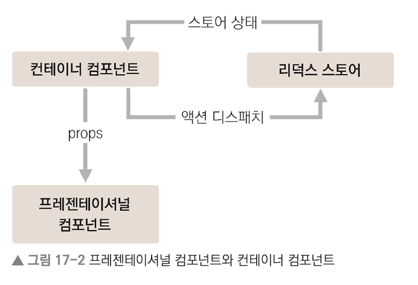

# 리액트 리덕스 사용하기

## 프로젝트 생성

```
yarn create react-app react-redux
```

### 라이브러리 설치

```
yarn add redux react-redux
```

<br>

## 프로젝트 패턴 

프레젠테이셔널 컴포넌트와 컨테이너 컴포넌트를 분리   
* 프레젠테이셔널 컴포넌트 `src/components`
  * 주로 상태 관리가 이루어지지 않고, 그저 props를 받아 와서 화면에 UI를 보여 주기만 하는 컴포넌트
* 컨테이너 컴포넌트 `src/containers`
  * 리덕스와 연동되어 있는 컴포넌트
  * 리덕스로부터 상태를 받아 오거나, 리덕스 스토어에 액션을 디스패치



### 장점 
* 코드의 재사용성 증가
* 관심사의 분리 -> UI를 작성할 때 편리

