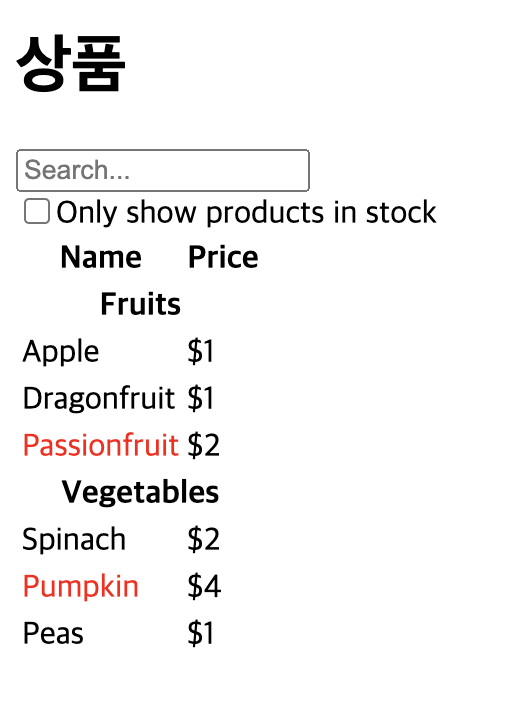

# Thinking in React 

## 프로젝트 설명 

[📌 Thinking in React](https://react.dev/learn/thinking-in-react) 를 참고한 실습입니다.

 

## 관련 링크

[✍️ 데브노트 3주차 React Component](https://shinjungohs-dev-road.gitbook.io/megaptera-frontend/undefined/week3/reactcomponent)  
[✍️ 데브노트 3주차 React State](https://shinjungohs-dev-road.gitbook.io/megaptera-frontend/undefined/week3/reactstate)

 

## 프로젝트 이미지

 

## 진행 내용

###  React Component

#### Start with the mockup

1. chore: 개발 환경 세팅
2. feat: Thinking in React 예제 UI 구현

#### Step 1: Break the UI into a component hierarchy

3. refactor: ProductsInCategory 컴포넌트 분리 및 types 폴더 분리
4. refactor: ProductRow 컴포넌트 분리
5. refactor: ProductCategoryRow 컴포넌트 분리
6. refactor: ProductTable 컴포넌트 분리
7. refactor: selectProducts 함수 분리 및 ProductTableProps 타입 선언
8. refactor: FilterableProductTable, SearchBar, CheckBoxField 컴포넌트 분리
9. refactor: selectCategories 함수 분리 

#### Step 2: Build a static version in React

10. feat: Product 재고 유무에 따른 name 색상 변경

###  React State

#### Step 3: Find the minimal but complete representation of UI state

11. feat: TextField 컴포넌트 분리 및 SearchBar 상태관리 추가

#### Step 4: Identify where your state should live
#### Step 5: Add inverse data flow

12. feat: filterText 상태 Lifting State Up 및 filterProducts 함수 분리 
13. feat: inStockOnly 상태 Lifting State Up

 

